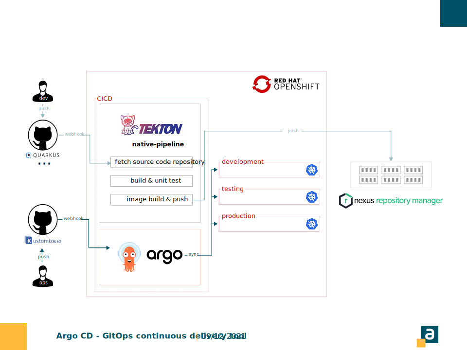

<!--START style -->
<style>
  :root 
  {
    --color-background: #fff;
    --color-foreground: #333;
    --color-highlight: #f96;
    --color-dimmed: #888;
  }
  h1 {color: #ffba3a; padding-top:0.1em;}
  section {background-color: white; font-family:calibri; color:#005366;}
  p{font-size:0.7em; font-family:calibri; text-align:justify;}
  footer {margin:0; padding:0; height:5%;}
  header {color:#005366; padding:30px; margin-left:30px; font-size:0.8em;}
  pre {font-size: 0.6em;}
  ul li {font-size:0.7em; font-family:calibri; text-align:justify;}
</style>
<!--END style -->

<style scoped>
    header{display:none;}
    footer{display:none;}    
</style>
<!-- INTRO -->


---

<!-- SLIDE1 -->
<!-- header: '**DESCRIZIONE**  $\color{#ffba3a}{|}$  _Argo CD_' -->
#

Argo CD è un **continuous delivery tool**, che triggera i cambiamenti effettuati su una repository remota (la repository rappresenta l'unica fonte di verità per le configurazioni degli applicativi sul cluster).

**Caratteristiche** 
- Il tool monitora i cambiamenti su K8s e ne preserva il suo stato di salute.

---
<!-- SLIDE2 -->
<!-- header: '**FLUSSO OPERATIVO**  $\color{#ffba3a}{|}$  _Argo CD_' -->
# 

Le configurazioni, sulla repository remota, sono aggiornate manualmente (DevOps team) o attraverso uno specifico automatismo (ad esempio Pipeline).


---
<!-- SLIDE3 -->
<!-- header: '**INSTALLAZIONE**  $\color{#ffba3a}{|}$  _Argo CD_' -->
# 

L'initialization parte dalla definizione di un **application.yaml**

```
apiVersion: argoproj.io/v1alpha1
kind: Application
metadata:
  name: myapp-argo-application
  namespace: argocd
spec:
  project: default

  source:
    repoURL: https://github.com/dargentieri/test_argocd.git
    targetRevision: HEAD
    path: environments/dev
  destination:
    server: https://kubernetes.default.svc
    namespace: myapp
```
*Nota bene: Argo CD per il suo primo avvio richiede un **apply** dell'application.yaml*.

---
<!-- SLIDE4 -->
<!-- header: '**POOLING**  $\color{#ffba3a}{|}$  _Argo CD e GitHub_' -->
# 

L'aggiornamento delle configurazioni presenti su K8S sono strettamente legate all'aggiornamento delle configurazioni sulla repository remota.
- L'attivazione di Argo CD e il conseguente cambio di configurazioni sul cluster è determinato da una **notifica di aggiornamento** (webhook), proveniente dal provider scelto per la gestione della stessa repository remota (GitHub, Bitbucket, ecc). 

*Nota bene: Di default il pooling, in assenza del webhook, è schedulato da Argo CD ogni **3 minuti**.*

---
<!-- SLIDE5 -->
<!-- header: '**CREDENZIALI DI ACCESSO**  $\color{#ffba3a}{|}$  _Argo CD e GitHub_' -->
#

Il salvataggio delle **credential** per la repository remota è gestito tramite la UI di **argocd-server**, che permette la definizione di una **connect** di tipo https, ssh o github app.

&nbsp;
&nbsp;
&nbsp;
&nbsp;
&nbsp;
&nbsp;
A seguito del salvataggio **argocd-server** genera una secret dal nome:
- ***repo** + uuid*

---
<!-- SLIDE6 -->
<!-- header: '**SALVAGUARDIA**  $\color{#ffba3a}{|}$  _Argo CD e GitHub_' -->
# 


---
<!-- SLIDE7 -->
<!-- header: '**SALVAGUARDIA**  $\color{#ffba3a}{|}$  _Argo CD e GitHub_' -->
#

Qualsiasi modifica manuale effettuata direttamente su K8s è rilevata da Argo CD e l'ipotetica divergenza creata tra lo **stato desiderato** e lo **stato attuale** viene colmata dallo stesso.

- La **divergenza** è gestita da Argo CD attraverso un riallineamento automatico o un'eventuale notifica di disallineamento.

*NOTA BENE: L'unica fonte di verità è rappresentata dalla repository remota.*

---
<!-- SLIDE8 -->
<!-- header: '**GESTIONE AMBIENTI MULTIPLI**  $\color{#ffba3a}{|}$  _Argo CD e GitHub_' -->
# 

La gestione di ambienti multipli presenta le seguenti caratteristiche:
- Argo CD è installato su ogni cluster relativo all'ambiente di riferimento;
- La sincronizzazione avviene a partire dalla stessa repository remota, ma i path definiti per Argo CD, afferiscono alle configurazioni di uno specifico ambiente.

---
<!-- SLIDE9 -->
<!-- header: '**DESCRIZIONE**  $\color{#ffba3a}{|}$  _Kustomize_' -->
# 

Kustomize è uno strumento, integrato in kubectl, che consente di personalizzare la creazione di oggetti Kubernetes tramite un file chiamato **“kustomization.yaml”**. 

**Caratteristiche** 
- Il tool permette di applicare delle patches a partire da delle configurazioni di base, senza modificare i file YAML effettivi;
- Si integra perfettamente con Argo CD.

---
<!-- SLIDE10 -->
<!-- header: '**Root**  $\color{#ffba3a}{|}$  _Argo CD + Kustomize_' -->
# 


---
<!-- SLIDE11 -->
<!-- header: '**CONFIGURAZIONI AMBIENTE**  $\color{#ffba3a}{|}$  _Argo CD + Kustomize_' -->
# 

Argo CD presenta un path di configurazione per ogni ambiente, le cui specifiche sono delineate a partire dal kustomization.yaml.

Il kustomization.yaml afferisce a delle configurazioni di base a cui viene applicato un override, così da personalizzare le configurazioni per lo specifico ambiente.

---
<!-- SLIDE12 -->
<!-- header: '**INFRASTRUTTURA**  $\color{#ffba3a}{|}$  _Argo CD + Kustomize_' -->
# 



---
<!-- SLIDE13 -->
<!-- header: '**LAYOUT DI BASE**  $\color{#ffba3a}{|}$  _Root_' -->
#

La repository è suddivisa in:
  - ***application.yaml*** → configurazioni di lancio;
  - **base** → template generale per gli applicativi presenti sul cluster;
  - **environments** → configurazioni per i diversi ambienti;
  - **init** → configurazioni di setup environment per il cluster.

Per quanto riguarda le folder di base e dell'environments, è possibile definire due scenari alternativi:
- **Scenario 1** : Suddivisione logica basata sulle diverse tipologie di risorse kubernetes (cronjobs,services, deployments, ecc);
- **Scenario 2** : Suddivisione logica basata sugli applicativi presenti all'interno del cluster K8s.

---
<!-- SLIDE14 -->
<!-- header: '**LAYOUT DI BASE**  $\color{#ffba3a}{|}$  _Scenario 1_' -->
#

La folder di **base** è suddivisa nella seguente maniera:
  - ***kustomizaziont.yaml*** → ha i riferimenti alle configurazioni di base
  - services
  - cronjobs
  - deployments
  - ...
  - configmaps

Ogni sottofolder, contiene gli yaml di configurazione. Ad esempio:
  - *webserver.yaml*
  - *cassa.yaml*

---
<!-- SLIDE15 -->
<!-- header: '**LAYOUT DI BASE**  $\color{#ffba3a}{|}$  _Scenario 1_' -->
#

La folder di **environments** è suddivisa nella seguente maniera:
  - sviluppo
  - collaudo
  - ...
  - produzione

Ogni sottofolder fa riferimento ad un ambiente specifico.

*Nota bene: Le folder di environments rappresentano il path da assegnare ad Argo CD al momento della configurazione del cluster. 
Ad esempio, path = environments/sviluppo.*

---
<!-- SLIDE16 -->
<!-- header: '**LAYOUT DI BASE**  $\color{#ffba3a}{|}$  _Scenario 1_' -->
#

Ogni **environment** presenta le seguenti configurazioni:
  - ***kustomization.yaml*** → Contiene un riferimento alla kustomization di base, alle patches , alle configmaps specifiche dell'ambiente, alle environment variables, alle immagini dei containers (questo permette di eseguire con facilità un rolling update).
  - cronjobs
  - services
  - deployments
  - ...
  - globalconfigmaps

Le risorse contengono internamente una folder per ogni applicazione e/o servizio presente sul cluster.

---
<!-- SLIDE17 -->
<!-- header: '**LAYOUT DI BASE**  $\color{#ffba3a}{|}$  _Scenario 1_' -->
#

Ad esempio per i deployments avremo:
  - oracle
  - webserver
  - cassa
  - ...

All'interno di ogni folder ci sono i riferimenti a delle specifiche relative ad ogni tipologia di risorsa, ad esempio per la risorsa deployments:
  - ***replicas.yaml*** → numero di istanze;
  - ***resources.yaml*** → risorse assegnate ad ogni pod;
  - ***variables.yaml*** → variabili d'ambiente utilizzate dai singoli pod.

---
<!-- SLIDE18 -->
<!-- header: '**LAYOUT DI BASE**  $\color{#ffba3a}{|}$  _Scenario 1_' -->
#

Di seguito il **kustomization.yaml** legato allo specifico ambiente:
```
bases:
    - ../../base
patches:
    - deployments/mysql/resources.yaml
    - deployments/ngnix/replicas.yaml
    - ...
    - cronjobs/p13cronjob/resources.yaml
    - cronjobs/p13cronjob/scheduling.yaml
configMapGenerator:
- name: example-config
  namespace: myapp
  files:
  - globalconfigmaps/config.json
patchesStrategicMerge:
    - deployments/mysql/variables.yaml
    - ...
    - deployments/webserver/variables.yaml
images:
- name: webserver
  newTag: 1.0.1
- ...
- name: p13
  newTag: master-latest
```
---
<!-- SLIDE19 -->
<!-- header: '**LAYOUT DI BASE**  $\color{#ffba3a}{|}$  _Scenario 2_' -->
#

La folder di **base** presenta al suo interno:
  - ***kustomizaziont.yaml*** 
  - cassa
  - oracle
  - p13
  - ...
  - globalconfigmaps

Ogni sottofolder rappresenta un riferimento ad una applicazione presente sul cluster, quest'ultime contengono a loro volta ogni tipologia di risorsa K8s ad esse associate.

---
<!-- SLIDE20 -->
<!-- header: '**LAYOUT DI BASE**  $\color{#ffba3a}{|}$  _Scenario 2_' -->
#

Ogni **environment** presenta le seguenti configurazioni:
  - ***kustomization.yaml*** → Contiene un riferimento alla kustomization di base, alle patches , alle configmaps specifiche dell'ambiente, alle environment variables, alle immagini dei containers (questo permette di eseguire con facilità un rolling update).
  - cassa
  - oracle
  - p13
  - ...
  - globalconfigmaps

Le folder delle app contengono a loro volta dei file yaml relativi ad ogni tipologia di risorsa associata al cluster per quella specifica app.
