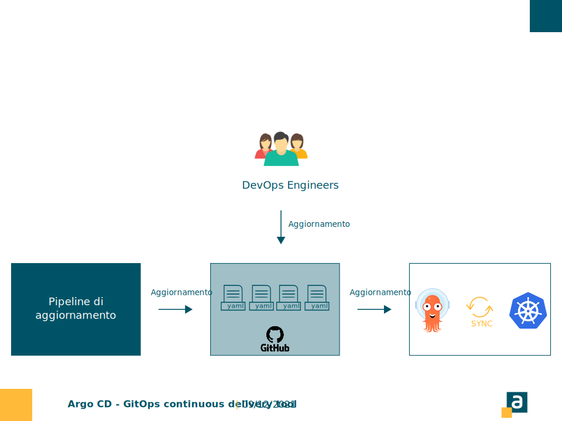

<!--START style -->
<style>
  :root 
  {
    --color-background: #fff;
    --color-foreground: #333;
    --color-highlight: #f96;
    --color-dimmed: #888;
  }
  h1 {color: #ffba3a; padding-top:0.1em;}
  section {background-color: white; font-family:calibri; color:#005366;}
  p{font-size:0.7em; font-family:calibri; text-align:justify;}
  footer {margin:0; padding:0; height:5%;}
  header {color:#005366; padding:30px; margin-left:30px; font-size:0.8em;}
  pre {font-size: 0.6em; border: none;}
  ul li {font-size:0.7em; font-family:calibri; text-align:justify;}
</style>
<!--END style -->

<style scoped>
    header{display:none;}
    footer{display:none;}    
</style>
<!-- INTRO -->


---

<!-- SLIDE1 -->
<!-- header: '**DESCRIZIONE**  $\color{#ffba3a}{|}$  _Argo CD_' -->
#

Argo CD è un **continuous delivery tool**, che recepisce tutti i cambiamenti effettuati sulle configurazioni presenti su una repository remota (la repository rappresenta l'unica fonte di verità per le configurazioni degli applicativi che operano sul cluster kubernetes).

**Caratteristiche** 
- Il tool monitora i cambiamenti su K8s e ne preserva lo stato di salute.
- Consente una facile integrazione di plugin per la gestione delle notifiche ([Argo CD Notification](https://argocd-notifications.readthedocs.io/en/stable/)) e dei secret ([Argo CD Vault](https://github.com/argoproj-labs/argocd-vault-plugin)).

---
<!-- SLIDE2 -->
<!-- header: '**FLUSSO OPERATIVO**  $\color{#ffba3a}{|}$  _Argo CD_' -->
# 

Le configurazioni, sulla repository remota, sono aggiornate manualmente (DevOps team) o attraverso uno specifico automatismo (ad esempio Pipeline).

---
<!-- SLIDE3 -->
<!-- header: '**INSTALLAZIONE**  $\color{#ffba3a}{|}$  _Argo CD_' -->
# 

L'initialization parte dalla definizione di **argocd.yaml** i cui elementi caratterizzanti sono:
- **namespace** → namespace su cui Argo CD è installato.
```yaml
metadata:
  name: myapp-argo-application
  namespace: argocd
```
**source** → repository GitHub, con puntamento al commit e al relativo path dell'ambiente.
```yaml
  source:
    repoURL: https://github.com/dargentieri/test_argocd.git
    targetRevision: HEAD
    path: environments/dev
```
---
<!-- SLIDE4 -->
<!-- header: '**INSTALLAZIONE**  $\color{#ffba3a}{|}$  _Argo CD_' -->
#
# 

- **destination** → cluster K8s e namespace su cui Argo CD effettua operazioni di aggiornamento/monitoraggio sulle configurazioni degli applicativi presenti sul cluster.
```yaml
  destination:
    server: https://kubernetes.default.svc
    namespace: myapp
```
---
<!-- SLIDE5 -->
<!-- header: '**POOLING**  $\color{#ffba3a}{|}$  _Argo CD e GitHub_' -->
# 

L'aggiornamento delle configurazioni presenti su K8S sono strettamente legate all'aggiornamento delle configurazioni sulla repository remota.
- L'attivazione di Argo CD e il conseguente cambio di configurazioni sul cluster è determinato da una **notifica di aggiornamento** (webhook), proveniente dal provider scelto per la gestione della stessa repository remota (GitHub, Bitbucket, ecc). 

*Nota bene: Di default il pooling, in assenza del webhook, è schedulato da Argo CD ogni **3 minuti**.*

---
<!-- SLIDE6 -->
<!-- header: '**CREDENZIALI DI ACCESSO**  $\color{#ffba3a}{|}$  _Argo CD e GitHub_' -->
#

Il salvataggio delle **credential** per la repository remota è gestito tramite la UI di **argocd-server**, che permette la definizione di una **connect** di tipo https, ssh o github app.

&nbsp;
&nbsp;
&nbsp;
&nbsp;
&nbsp;
&nbsp;
A seguito del salvataggio **argocd-server** genera una secret dal nome:
- ***repo** + uuid*

---
<!-- SLIDE7 -->
<!-- header: '**SALVAGUARDIA**  $\color{#ffba3a}{|}$  _Argo CD e GitHub_' -->
# 
Argo CD monitora e aggiorna le configurazioni di tutte le applicazioni che si trovano in uno specifico namespace definito nella fase di initialization.


---
<!-- SLIDE8 -->
<!-- header: '**SALVAGUARDIA**  $\color{#ffba3a}{|}$  _Argo CD e GitHub_' -->
# 
L'applicazione di una qualsiasi modifica manuale sulle configurazioni, per lo specifo namespace monitorato da Argo CD, determina uno stato di inconsistenza.


---
<!-- SLIDE9 -->
<!-- header: '**SALVAGUARDIA**  $\color{#ffba3a}{|}$  _Argo CD e GitHub_' -->
#

L'ipotetica divergenza creata tra lo **stato desiderato** e lo **stato attuale** viene colmata da Argo CD.

- La **divergenza** è gestita da Argo CD attraverso un riallineamento automatico o un'eventuale notifica di disallineamento.

*NOTA BENE: L'unica fonte di verità è rappresentata dalla repository remota.*

---
<!-- SLIDE10 -->
<!-- header: '**GESTIONE AMBIENTI MULTIPLI**  $\color{#ffba3a}{|}$  _Argo CD e GitHub_' -->
# 

La gestione di ambienti multipli presenta le seguenti caratteristiche:
- Argo CD è installato su ogni cluster relativo all'ambiente di riferimento;
- La sincronizzazione avviene a partire dalla stessa repository remota, ma i path definiti per Argo CD, afferiscono alle configurazioni di uno specifico ambiente.

---
<!-- SLIDE11 -->
<!-- header: '**DESCRIZIONE**  $\color{#ffba3a}{|}$  _Kustomize_' -->
# 

Kustomize è uno strumento, integrato in kubectl, che consente di personalizzare la creazione di oggetti Kubernetes tramite un file chiamato **“kustomization.yaml”**. 

**Caratteristiche** 
- Il tool permette di applicare delle patches a partire da delle configurazioni di base, senza modificare i file YAML effettivi;
- Si integra perfettamente con Argo CD.

---
<!-- SLIDE12 -->
<!-- header: '**Root**  $\color{#ffba3a}{|}$  _Argo CD + Kustomize_' -->
# 


---
<!-- SLIDE13 -->
<!-- header: '**CONFIGURAZIONI AMBIENTE**  $\color{#ffba3a}{|}$  _Argo CD + Kustomize_' -->
# 

Argo CD presenta un path di configurazione per ogni ambiente, le cui specifiche sono delineate a partire dal kustomization.yaml.

Il kustomization.yaml afferisce a delle configurazioni di base a cui viene applicato un override, così da personalizzare le configurazioni per lo specifico ambiente.

---
<!-- SLIDE14 -->
<!-- header: '**LAYOUT DI BASE**  $\color{#ffba3a}{|}$  _Root_' -->
#

La repository è suddivisa in:
#
  - **base** → template generale per gli applicativi presenti sul cluster;
  - **environments** → configurazioni per i diversi ambienti;
  - **init** → configurazioni di setup environment per Argo CD.
#
Per quanto riguarda le folder di base e dell'environments vi è una suddivisione logica basata sugli applicativi presenti all'interno del cluster K8s.

---
<!-- SLIDE15 -->
<!-- header: '**LAYOUT DI BASE**  $\color{#ffba3a}{|}$  _Init_' -->
#
// Definire init

---
<!-- SLIDE15 -->
<!-- header: '**LAYOUT DI BASE**  $\color{#ffba3a}{|}$  _Base_' -->
#

La folder di **base** presenta al suo interno:
  - ***kustomizazion.yaml*** → ha i riferimenti alle configurazioni di base
  - global
  - cassette
  - fatture-di-gruppo
  - cassa
  - ....

Ogni sottofolder rappresenta un riferimento ad una applicazione presente sul cluster, quest'ultime contengono a loro volta ogni tipologia di risorsa K8s ad esse associate.

---

<!-- SLIDE16 -->
<!-- header: '**LAYOUT DI BASE**  $\color{#ffba3a}{|}$  _Environments_' -->
#

La folder di **environments** è suddivisa nella seguente maniera:
  - sviluppo
  - collaudo
  - ...
  - produzione

Ogni sottofolder fa riferimento ad un ambiente specifico.

*Nota bene: Le folder di environments rappresentano il path da assegnare ad Argo CD al momento della configurazione del cluster. 
Ad esempio, path = environments/sviluppo.*

---
<!-- SLIDE17 -->
<!-- header: '**LAYOUT DI BASE**  $\color{#ffba3a}{|}$  _Environment_' -->
#

Ogni **environment** presenta le seguenti configurazioni:
  - ***kustomization.yaml*** → Contiene un riferimento alla kustomization di base, alle patches , alle configmaps specifiche dell'ambiente, alle environment variables, alle immagini dei containers (questo permette di eseguire con facilità un rolling update).
  - global
  - cassette
  - fatture-di-gruppo
  - cassa
  - ....

Le folder delle app contengono a loro volta dei file yaml relativi ad ogni tipologia di risorsa associata al cluster per quella specifica app.

---
<!-- SLIDE18 -->
<!-- header: '**LAYOUT DI BASE**  $\color{#ffba3a}{|}$  _Kustomization_' -->
#

Il **kustomization.yaml** legato allo specifico ambiente, presenta le seguenti caratteristiche:
- Riferimento alle configurazioni di base
```
bases:
  - ../../base
```
