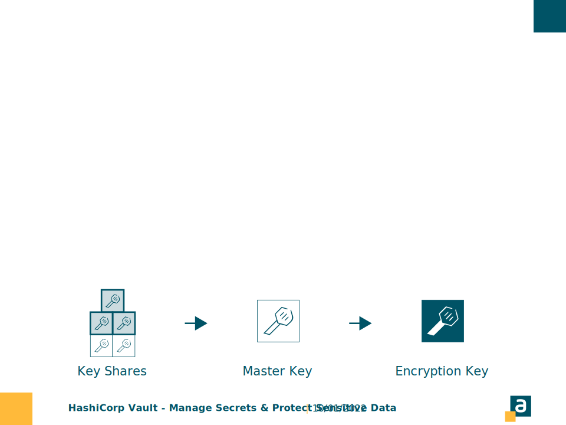

<!--START style -->
<style>
  :root 
  {
    --color-background: #fff;
    --color-foreground: #333;
    --color-highlight: #f96;
    --color-dimmed: #888;
  }
  h1 {color: #ffba3a; padding-top:0.1em;}
  section {background-color: white; font-family:calibri; color:#005366;}
  p{font-size:0.7em; font-family:calibri; text-align:justify;}
  footer {margin:0; padding:0; height:5%;}
  header {color:#005366; padding:30px; margin-left:30px; font-size:0.8em;}
  pre {font-size: 0.6em; border: none;}
  ul li {font-size:0.7em; font-family:calibri; text-align:justify;}
  ol li {font-size:0.7em; font-family:calibri; text-align:justify;}
</style>
<!--END style -->

<style scoped>
    header{display:none;}
    footer{display:none;}    
</style>
<!-- INTRO -->


---

<!-- SLIDE1 -->
<!-- header: '**DESCRIZIONE**  $\color{#ffba3a}{|}$  _Argo CD_' -->
#

Argo CD è un **continuous delivery tool**, che recepisce tutti i cambiamenti effettuati sulle configurazioni presenti su una repository remota (la repository rappresenta l'unica fonte di verità per le configurazioni degli applicativi che operano sul cluster kubernetes).

**Caratteristiche** 
- Il tool monitora i cambiamenti su K8s e ne preserva lo stato di salute.
- Consente una facile integrazione di plugin per la gestione delle notifiche ([Argo CD Notification](https://argocd-notifications.readthedocs.io/en/stable/)) e dei secret ([Argo CD Vault](https://github.com/argoproj-labs/argocd-vault-plugin)).

---
<!-- SLIDE2 -->
<!-- header: '**FLUSSO OPERATIVO**  $\color{#ffba3a}{|}$  _Argo CD_' -->
# 

Le configurazioni, sulla repository remota, sono aggiornate manualmente (DevOps team) o attraverso uno specifico automatismo (ad esempio Pipeline).

---
<!-- SLIDE3 -->
<!-- header: '**INSTALLAZIONE**  $\color{#ffba3a}{|}$  _Argo CD_' -->
# 

L'initialization parte dalla definizione di **argocd.yaml** i cui elementi caratterizzanti sono:
- **namespace** → namespace su cui Argo CD è installato.
```yaml
metadata:
  name: myapp-argo-application
  namespace: argocd
```
- **source** → repository GitHub, con puntamento al commit e al relativo path dell'ambiente.
```yaml
  source:
    repoURL: https://github.com/dargentieri/test_argocd.git
    targetRevision: HEAD
    path: environments/dev
```
---
<!-- SLIDE4 -->
<!-- header: '**INSTALLAZIONE**  $\color{#ffba3a}{|}$  _Argo CD_' -->
#
# 

- **destination** → cluster K8s e namespace su cui Argo CD effettua operazioni di aggiornamento/monitoraggio sulle configurazioni degli applicativi presenti sul cluster.
```yaml
  destination:
    server: https://kubernetes.default.svc
    namespace: myapp
```
---
<!-- SLIDE5 -->
<!-- header: '**POOLING**  $\color{#ffba3a}{|}$  _Argo CD e GitHub_' -->
# 

L'aggiornamento delle configurazioni presenti su K8S sono strettamente legate all'aggiornamento delle configurazioni sulla repository remota.
- L'attivazione di Argo CD e il conseguente cambio di configurazioni sul cluster è determinato da una **notifica di aggiornamento** (webhook), proveniente dal provider scelto per la gestione della stessa repository remota (GitHub, Bitbucket, ecc). 

*Nota bene: Di default il pooling, in assenza del webhook, è schedulato da Argo CD ogni **3 minuti**.*

---
<!-- SLIDE6 -->
<!-- header: '**CREDENZIALI DI ACCESSO**  $\color{#ffba3a}{|}$  _Argo CD e GitHub_' -->
#

Il salvataggio delle **credential** per la repository remota è gestito tramite la UI di **argocd-server**, che permette la definizione di una **connect** di tipo https, ssh o github app.

&nbsp;
&nbsp;
&nbsp;
&nbsp;
&nbsp;
&nbsp;
A seguito del salvataggio **argocd-server** genera una secret dal nome:
- ***repo** + uuid*

---
<!-- SLIDE7 -->
<!-- header: '**SALVAGUARDIA**  $\color{#ffba3a}{|}$  _Argo CD e GitHub_' -->
# 
Argo CD monitora e aggiorna le configurazioni di tutte le applicazioni che si trovano in uno specifico namespace definito nella fase di initialization.


---
<!-- SLIDE8 -->
<!-- header: '**SALVAGUARDIA**  $\color{#ffba3a}{|}$  _Argo CD e GitHub_' -->
# 
L'applicazione di una qualsiasi modifica manuale sulle configurazioni, per lo specifo namespace monitorato da Argo CD, determina uno stato di inconsistenza.


---
<!-- SLIDE9 -->
<!-- header: '**SALVAGUARDIA**  $\color{#ffba3a}{|}$  _Argo CD e GitHub_' -->
#

L'ipotetica divergenza creata tra lo **stato desiderato** e lo **stato attuale** viene colmata da Argo CD.

- La **divergenza** è gestita da Argo CD attraverso un riallineamento automatico o un'eventuale notifica di disallineamento.

*NOTA BENE: L'unica fonte di verità è rappresentata dalla repository remota.*

---
<!-- SLIDE10 -->
<!-- header: '**GESTIONE AMBIENTI MULTIPLI**  $\color{#ffba3a}{|}$  _Argo CD e GitHub_' -->
# 

La gestione di ambienti multipli presenta le seguenti caratteristiche:
- Argo CD è installato su ogni cluster relativo all'ambiente di riferimento;
- La sincronizzazione avviene a partire dalla stessa repository remota, ma i path definiti per Argo CD, afferiscono alle configurazioni di uno specifico ambiente.

---
<!-- SLIDE11 -->
<!-- header: '**DESCRIZIONE**  $\color{#ffba3a}{|}$  _Kustomize_' -->
# 

Kustomize è uno strumento, integrato in kubectl, che consente di personalizzare la creazione di oggetti Kubernetes tramite un file chiamato **“kustomization.yaml”**. 

**Caratteristiche** 
- Il tool permette di applicare delle patches a partire da delle configurazioni di base, senza modificare i file YAML effettivi;
- Si integra perfettamente con Argo CD.

---
<!-- SLIDE12 -->
<!-- header: '**Root**  $\color{#ffba3a}{|}$  _Argo CD + Kustomize_' -->
# 


---
<!-- SLIDE13 -->
<!-- header: '**CONFIGURAZIONI AMBIENTE**  $\color{#ffba3a}{|}$  _Argo CD + Kustomize_' -->
# 

Argo CD presenta un path di configurazione per ogni ambiente, le cui specifiche sono delineate a partire dal **kustomization.yaml**.

Il kustomization.yaml afferisce a delle configurazioni di base a cui viene applicato un override, così da personalizzare le configurazioni per lo specifico ambiente.

---
<!-- SLIDE14 -->
<!-- header: '**LAYOUT DI BASE**  $\color{#ffba3a}{|}$  _Root_' -->
#

La repository è suddivisa in:
#
  - **base** → template generale per gli applicativi presenti sul cluster;
  - **environments** → configurazioni per i diversi ambienti;
  - **init** → configurazioni di setup target environment per Argo CD.
#
Per quanto riguarda le folder di base e dell'environments vi è una suddivisione logica basata sugli applicativi presenti all'interno del cluster K8s.

---
<!-- SLIDE15 -->
<!-- header: '**LAYOUT DI BASE**  $\color{#ffba3a}{|}$  _Base_' -->
#

La folder di **base** presenta al suo interno:
  - ***kustomizazion.yaml*** → ha i riferimenti alle configurazioni di base
  - common → Contiene le configurazioni comuni per tutti gli applicativi
  - cassette
  - fatture-di-gruppo
  - cassa
  - ....

Ogni sottofolder rappresenta un riferimento ad una applicazione presente sul cluster, quest'ultime contengono a loro volta ogni tipologia di risorsa K8s ad esse associate.

---

<!-- SLIDE16 -->
<!-- header: '**LAYOUT DI BASE**  $\color{#ffba3a}{|}$  _Environments_' -->
#

La folder di **environments** è suddivisa nella seguente maniera:
  - sviluppo
  - collaudo
  - ...
  - produzione

Ogni sottofolder fa riferimento ad un ambiente specifico.

*Nota bene: Le folder di environments rappresentano il path da assegnare ad Argo CD al momento della configurazione del cluster. 
Ad esempio, path = environments/sviluppo.*

---
<!-- SLIDE17 -->
<!-- header: '**LAYOUT DI BASE**  $\color{#ffba3a}{|}$  _Environment_' -->
#

Ogni **environment** presenta le seguenti configurazioni:
  - ***kustomization.yaml*** → Contiene un riferimento alla kustomization di base, alle patches , alle configmaps specifiche dell'ambiente, alle environment variables, alle immagini dei containers (questo permette di eseguire con facilità un rolling update).
  - common → Contiene le configurazioni comuni per tutti gli applicativi
  - cassette
  - fatture-di-gruppo
  - cassa
  - ....

Le folder delle app contengono a loro volta dei file yaml relativi ad ogni tipologia di risorsa associata al cluster per quella specifica app.

---
<!-- SLIDE18 -->
<!-- header: '**LAYOUT DI BASE**  $\color{#ffba3a}{|}$  _Kustomization_' -->
#

Il **kustomization.yaml** dell'ambiente presenta le seguenti caratteristiche:
```yaml
#Riferimento alle configurazioni di base
bases: 
    - ../../base
#Patches sugli applicativi di business
patches: 
    - cassa/replicas.yaml
    - cassa/resources.yaml
#Applicazione di specifiche configmap
configMapGenerator: 
- name: log4j-config
  namespace: myapp
  behavior: merge
  files:
  - cassa/log4j2-spring.yml
#Injection delle variabili d'ambiente
patchesStrategicMerge: 
    - cassa/variables.yaml
#Gestione del versionamento immagini
images: 
- name: cassa
  newTag: latest
- name: experiment
  newTag: 1.0.6
```
---
<!-- SLIDE19 -->
<!-- header: '**GESTIONE SECRET**  $\color{#ffba3a}{|}$  _HashiCorp Vault_' -->
#

#
Per consentire pratiche GitOps più sicure, i dati sensibili non devono essere archiviati su GitHub e l'utilizzo di **Vault** come sistema di gestione dei secrets e della crittografia basato sull'identità, consente di ottenere una buona soluzione per la sicurezza, in quanto:
- L'accesso ai secret è controllato da metodi di autenticazione e autorizzazione;
- I dati sensibili sono archiviati e gestiti in modo sicuro, controllato e verificabile;


---
<!-- SLIDE20 -->
<!-- header: '**GESTIONE SECRET**  $\color{#ffba3a}{|}$  _HashiCorp Vault_' -->
#

#
Quando un server Vault viene avviato, parte in uno stato **Seal**. 

Vault è configurato per sapere dove e come accedere all'archiviazione fisica, ma non sa come decriptare. Per tale motivo, nella fase iniziale, viene effettuato l’**Unseal**, attraverso l'inserimento della chiave di decriptaggio.

Il **processo di apertura** rappresenta il processo di ottenimento della chiave master. Quest'ultima permette di leggere la chiave di decrittografia, che consente a sua volta di decriptare i dati.

---
<!-- SLIDE21 -->
<!-- header: '**GESTIONE SECRET**  $\color{#ffba3a}{|}$  _HashiCorp Vault_' -->
#

#
Vault utilizza un algoritmo noto come **la condivisione segreta di Shamir** per dividere la chiave in frammenti. 

Per ricostruire la chiave di unseal è necessaria una certa soglia di partizioni (3 su 5), che viene quindi utilizzata per decrittografare la chiave master.

Le partizioni vengono aggiunte una alla volta (in qualsiasi ordine) fino a quando non sono presenti abbastanza partizioni per ricostruire la chiave e decrittografare la chiave master.

---
<!-- SLIDE22 -->
<!-- header: '**GESTIONE SECRET**  $\color{#ffba3a}{|}$  _HashiCorp Vault_' -->
#

#
L'autenticazione Kubernetes consente a Vault di instaurare una comunicazione con il cluster, che avviene tramite un **service account token** Kubernetes. Il token è assegnato a ciascun pod al momento della sua creazione. 

Gli elementi necessari all'autenticazione sono:

---
<!-- SLIDE23 -->
<!-- header: '**GESTIONE SECRET**  $\color{#ffba3a}{|}$  _HashiCorp Vault_' -->
#

#
**PATH** → Sono archiviati i dati di interesse.
```sh
vault kv put secret/vplugin/supersecret username="pmo" password="gopadres"

```
La **POLICY** → Definisce la politica di accesso ai dati.
```sh
vault kv put secret/vplugin/supersecret username="pmo" password="gopadres"

```
Il **RUOLO** → Connette il service account Kubernetes e lo spazio dei nomi , con la policy definita precedentemente.
```sh
vault kv put secret/vplugin/supersecret username="pmo" password="gopadres"

```
---
<!-- SLIDE24 -->
<!-- header: '**GESTIONE SECRET**  $\color{#ffba3a}{|}$  _HashiCorp Vault_' -->
#

#
**Vault Agent Injector**  sfrutta il *mutating admission webhook* Kubernetes, per intercettare pod che presentano delle specifiche annotazioni, iniettando un contenitore *Vault Agent* per gestire i secret.

---
<!-- SLIDE25 -->
<!-- header: '**GESTIONE SECRET**  $\color{#ffba3a}{|}$  _HashiCorp Vault_' -->
#

#
Di seguito un esempio di deployment  con delle annotation utili a Vault per effettuare l'injection delle credenziali di accesso al db oracle:
```yaml
apiVersion: apps/v1
kind: Deployment
metadata:
  name: cassa
#...
spec:
#...
  template:
    metadata:
      annotations:
        vault.hashicorp.com/agent-inject: 'true'
        vault.hashicorp.com/role: 'internal-app'
        vault.hashicorp.com/agent-inject-secret-database-config.env: 'internal/data/database/config'
        vault.hashicorp.com/agent-inject-template-database-config.env: |
          {{- with secret "internal/data/database/config" -}}
          #!/bin/bash
          export user={{ .Data.data.username }}
          {{- end -}}
    spec:
      serviceAccountName: internal-app
      containers:
        - name: orgchart
          image: domenicoallitude/testenv
          command: ['sh', '-c', 'source vault/secrets/database-config.env && java -jar cassa.jar']
```
---
<!-- SLIDE26 -->
<!-- header: '**GESTIONE SECRET**  $\color{#ffba3a}{|}$  _HashiCorp Vault_' -->
#

#
//Difficoltà nella gestione delle secret con questo approccio rispetto al plugin ArgoCD Vault Plugin.

---
<!-- SLIDE27 -->
<!-- header: '**PLUGIN**  $\color{#ffba3a}{|}$  _ArgoCD Vault Plugin_' -->
#

#
Il plugin aiuta a risolvere il problema della gestione delle secrets con Vault e ArgoCD.

---

<!-- SLIDE28 -->
<!-- header: '**PLUGIN**  $\color{#ffba3a}{|}$  _ArgoCD Vault Plugin_' -->
#

#
Di seguito gli step che illustrano la meccanica di utilizzo del plugin:
1. Il platform team inizializza le secrets su specifici paths, definendo al contempo i nomi delle chiavi.
2. L'ops team inizializza le secret utilizzando al posto dei dati sensibili i placeholder (<username> <password> ...) ovvero i nomi delle chiavi definite dal platform nello step precedente.
3. Github a seguito del push sulla repository, da parte del team ops, invia una notifica di aggiornamento ad ArgoCD.
4. ArgoCD Vault Plugin estrae il valore dell'ultima versione della secret (a meno di particolari eccezioni) ed effettua una value injection.
5. Argo CD effettua l'apply della secret finale.
---

<!-- SLIDE29 -->
<!-- header: '**PLUGIN**  $\color{#ffba3a}{|}$  _ArgoCD Vault Plugin_' -->
#

#
Esempio di una secret presente sulla repository GitHub:
```yaml
kind: Secret
apiVersion: v1
metadata:
  name: example-secret
  namespace: default
  annotations:
    avp.kubernetes.io/path: "secret/data/vplugin/supersecret"
type: Opaque
stringData:
  username: <username>
  password: <password>
```
---
<!-- SLIDE30 -->
<!-- header: '**PLUGIN**  $\color{#ffba3a}{|}$  _ArgoCD Vault Plugin_' -->
#

#
Esempio di una secret, post elaborazione da parte del plugin, presente sul cluster Kubernetes:
```yaml
kind: Secret
apiVersion: v1
metadata:
  name: example-secret
  namespace: default
  annotations:
    avp.kubernetes.io/path: "secret/data/vplugin/supersecret"
type: Opaque
stringData:
  username: bXl1c2VybmFtZQo=
  password: bXlwYXNzd29yZAo=
```
---
<!-- END -->
<!-- header: ''-->
<!-- paginate:  -->
#


